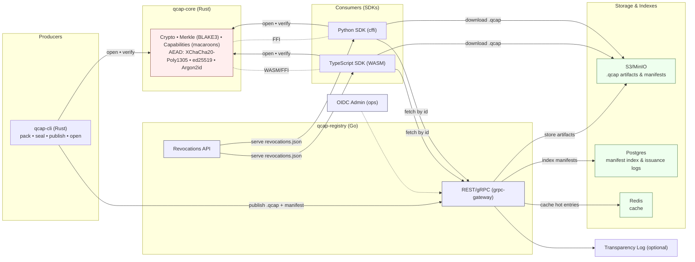

# Q-Cap

*Q-Cap* (Capability-based, encryptable content packages) is a packaging and distribution format that lets you **publish data openly** while keeping access **cryptographically controlled** by capabilities. Think: `.qcap` files that travel and sync like regular artifacts, but decrypt only for holders of the right capability tokens.

> Status: **alpha scaffold** — this repository currently includes a Rust core library and CLI demo, a minimal Go registry service, and a TypeScript SDK stub. The full MVP (pack/seal/open/verify/capabilities/registry) is being built in milestones.

---

## Why Q-Cap?

* **Confidentiality-by-default**: Envelope encryption per file with modern AEAD.
* **Least-privilege sharing**: Capability tokens (macaroons) with caveats (expiry, paths, audience).
* **Integrity & provenance**: BLAKE3 Merkle tree; signed manifest.
* **Portable**: Single-file `.qcap` artifact; easy to mirror/cdn.
* **Ecosystem-friendly**: SDKs for TypeScript and Python; registry with S3/MinIO.

---

## Repo structure

```
q-cap/
  core/
    qcap-core/       # Rust library (crypto & format building blocks)
    qcap-cli/        # Rust CLI (demo cmd available today)
  services/
    qcap-registry/   # Go minimal registry (health check endpoint)
  sdks/
    ts/              # TypeScript SDK stub
  api/
    proto/           # Protobuf IDL (stub)
  .github/workflows/ # CI
  docs/              # Project docs (stubs)
```

---

## Architecture (at a glance)



---

## Getting started

### Prerequisites

* **Git** and **GitHub CLI** (`gh auth login`)
* **Rust** (stable, MSVC on Windows)
* **Go** 1.21+
* **Node.js** (optional, for building the TS SDK)

#### Install on Windows (PowerShell)

```powershell
winget install Rustlang.Rustup
# If needed:
winget install Microsoft.VisualStudio.2022.BuildTools --silent --override "--add Microsoft.VisualStudio.Workload.VCTools --includeRecommended --passive --norestart"
winget install GoLang.Go
```

#### Install on macOS (Homebrew)

```bash
brew install rustup-init go gh node
rustup-init -y
gh auth login
```

> After installing Rust, restart your shell or add `~/.cargo/bin` (Windows: `%USERPROFILE%\.cargo\bin`) to your PATH.

---

## Clone & build

```bash
git clone https://github.com/<YOUR_OWNER>/q-cap
cd q-cap
cargo build --workspace
```

### Quick demo (CLI)

The demo subcommand just computes a BLAKE3 “root” over input bytes:

```bash
cargo run -p qcap-cli -- hash "hello world"
# -> blake3:7d8d... (hash will vary)
```

### Run the registry (dev)

```bash
cd services/qcap-registry
go run .
# GET http://localhost:8080/health  -> {"status":"ok"}
```

### Build the TS SDK stub

```bash
cd sdks/ts
npm install --silent || true
npm run build
```

---

## Roadmap to MVP

Planned commands and features (tracked in GitHub Issues):

* `qcap init` — local key material (Argon2id-protected), fingerprint printout
* `qcap pack` — create `.qcap` archive with `manifest.json`, `payload/`, `meta/`
* `qcap seal` — per-file XChaCha20-Poly1305 envelope encryption, recipients
* `qcap open` — verify + decrypt with capability; caveats enforced
* `qcap grant` — mint macaroons with caveats (expiry, audience, paths)
* `qcap revoke` — soft revocation with signed `revocations.json`
* `qcap inspect` — summarize manifest, recipients, Merkle root
* `qcap publish` / `qcap fetch` — push/pull via registry (S3/MinIO)

*Server side*:

* REST/gRPC endpoints with OpenAPI, Postgres manifest index, Redis cache
* OIDC admin auth; PAT for automation
* Observability: OpenTelemetry traces/metrics; structured logs

SDKs:

* **TypeScript (WASM)**: open/inspect/verify in browser/Node
* **Python (cffi)**: data-pipeline friendly verify/open

---

## Q-Cap format (preview)

A `.qcap` is a **single file** (ZIP or tar+gz) containing:

* `manifest.json` — schema version, Merkle root, issuer, policies, metadata
* `payload/` — arbitrary files (optionally encrypted per file)
* `meta/` — readme, license, schemas, STAC/OGC tags
* `signatures/` — detached signatures (ed25519) over the manifest & Merkle root

**Integrity**: BLAKE3 Merkle tree over payload files (root is signed).
**Confidentiality**: XChaCha20-Poly1305 per file; data keys wrapped to recipients.
**Capabilities**: Macaroons with caveats (expiry, audience, allowed paths, purpose).
**Revocation (soft)**: signed `revocations.json` published to the registry.

---

## Security model (high level)

* Memory-safe languages (Rust core; Go service)
* Modern crypto defaults (XChaCha20-Poly1305, BLAKE3, ed25519, Argon2id)
* Keys:

  * Dev: encrypted keyfiles
  * Prod: cloud KMS / HSM for issuer roots; rotation documented
* Supply chain:

  * CI includes CodeQL, SBOM (Syft), image scanning (Trivy), signed releases (cosign)

> **Important:** Q-Cap’s security depends on proper key handling and capability distribution. Never commit secrets; review `SECURITY.md` before enabling external publication.

---

## Geospatial & GeoPackage

Q-Cap is payload-agnostic but designed to carry geospatial content. The MVP will document how to:

* Transport **GeoPackage** unchanged inside `.qcap`
* Embed STAC/OGC metadata in `meta/`
* Stream-verify large rasters via Merkle while fetching ranges

---

## GBA+ and Accessibility

We aim for a bilingual CLI (`--lang en|fr`) and accessible documentation. Capability policies and metadata should be reviewed for impacts on diverse users and use cases. See `docs/gba-plus-note.md`.

---

## Contributing

We welcome issues and PRs. Please read:

* `CONTRIBUTING.md` — how to propose changes & run tests
* `CODE_OF_CONDUCT.md` — expected behavior
* `SECURITY.md` — reporting vulnerabilities

Use **Conventional Commits** (e.g., `feat(cli): add grant command`) and open an issue before large changes.

---

## License & citation

* **License:** Apache-2.0 (see `LICENSE`)
* **Cite:** `CITATION.cff` (to be added)

---

## Quick commands reference

```bash
# Build everything
cargo build --workspace

# Run CLI demo
cargo run -p qcap-cli -- hash "hello"

# Registry health check
(cd services/qcap-registry && go run .)
curl http://localhost:8080/health
```

---

## FAQ

**Q: Can I publish `.qcap` files publicly without leaking content?**
A: Yes—when sealed, payloads are encrypted. Keep manifests private by default unless your policy allows public manifests.

**Q: Does Q-Cap replace a Protected B cloud environment?**
A: Not automatically. It can reduce exposure by encrypting artifacts at rest and in transit, but operational constraints and classification rules still apply. See ADR-0009 once finalized.
