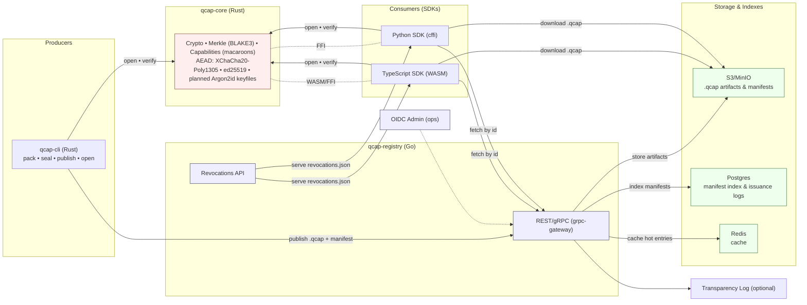

# Q-Cap

*Q-Cap* (Capability-based, encryptable content packages) is a packaging and distribution format that lets you **publish data openly** while keeping access **cryptographically controlled** by capabilities. Think: `.qcap` files that travel and sync like regular artifacts, but decrypt only for holders of the right capability tokens.

> Status: **working local MVP** - this repository includes a Rust core library and CLI, a minimal Go registry service, and a TypeScript SDK stub. The core MVP flow is implemented locally: create identities, seal encrypted `.qcap` artifacts, verify them, publish/fetch through the dev registry, grant path-scoped capabilities, open authorized payloads, and block revoked capabilities.

---

## Why Q-Cap?

* **Confidentiality-by-default**: Envelope encryption per file with modern Authentication Encryption with Associated Data (AEAD).
* **Least-privilege sharing**: Capability tokens (macaroons) with caveats (expiry, paths, audience).
* **Integrity & provenance**: BLAKE3 Merkle tree; signed manifest.
* **Portable**: Single-file `.qcap` artifact; easy to mirror/cdn.
* **Ecosystem-friendly**: SDKs for TypeScript and Python; registry with S3/MinIO.

---

## Repo structure

```
q-cap/
  core/
    qcap-core/       # Rust library (crypto and format building blocks)
    qcap-cli/        # Rust CLI for init, pack, seal, verify, inspect, grant, open, revoke, publish/fetch
  services/
    qcap-registry/   # Go dev registry for health, artifact index/download, publish, and revocations
  sdks/
    ts/              # TypeScript SDK stub
  api/
    proto/           # Protobuf IDL (stub)
  .github/workflows/ # CI
  docs/              # Project docs (stubs)
```

---

## Architecture (at a glance)


```mermaid
flowchart LR
  %% Q-Cap: Architecture at a glance

  %% --- Producers / CLI ---
  subgraph Producers["Producers"]
    CLI["qcap-cli (Rust)\npack • seal • publish • open"]
  end

  %% --- Registry Service ---
  subgraph Registry["qcap-registry (Go)"]
    API["REST/gRPC (grpc-gateway)"]
    REV["Revocations API"]
  end

  %% --- Storage & Indexes ---
  subgraph Storage["Storage & Indexes"]
    S3["S3/MinIO\n.qcap artifacts & manifests"]
    PG["Postgres\nmanifest index & issuance logs"]
    RED["Redis\ncache"]
  end

  %% --- Core Library ---
  subgraph Core["qcap-core (Rust)"]
    CORE["Crypto • Merkle (BLAKE3) • Capabilities (macaroons)\nAEAD: XChaCha20-Poly1305 • ed25519 • planned Argon2id keyfiles"]
  end

  %% --- Consumers / SDKs ---
  subgraph Consumers["Consumers (SDKs)"]
    TS["TypeScript SDK (WASM)"]
    PY["Python SDK (cffi)"]
  end

  %% --- Optional integrations ---
  TLOG["Transparency Log (optional)"]
  OIDC["OIDC Admin (ops)"]

  %% --- Flows ---
  CLI -->|publish .qcap + manifest| API
  API -->|store artifacts| S3
  API -->|index manifests| PG
  API -->|cache hot entries| RED
  API --> TLOG
  OIDC -.-> API

  %% Fetch paths
  TS -->|fetch by id| API
  PY -->|fetch by id| API
  TS -->|download .qcap| S3
  PY -->|download .qcap| S3

  %% Open/verify using core semantics
  TS -->|open • verify| CORE
  PY -->|open • verify| CORE
  CLI -->|open • verify| CORE

  %% Revocations
  REV -->|serve revocations.json| TS
  REV -->|serve revocations.json| PY

  %% Bindings
  CORE -. WASM/FFI .- TS
  CORE -. FFI .- PY

  %% Styling
  classDef svc fill:#eef,stroke:#446,stroke-width:1px;
  classDef store fill:#efe,stroke:#474,stroke-width:1px;
  classDef core fill:#fee,stroke:#844,stroke-width:1px;
  class API,REV,OIDC svc;
  class S3,PG,RED store;
  class CORE core;
```

---

## Getting started

### Prerequisites

* **Git** and **GitHub CLI** (`gh auth login`)
* **Rust** (stable, MSVC on Windows)
* **Go** 1.21+
* **Node.js** (optional, for building the TS SDK)

#### Install on Windows (PowerShell)

```powershell
winget install Rustlang.Rustup
# If needed:
winget install Microsoft.VisualStudio.2022.BuildTools --silent --override "--add Microsoft.VisualStudio.Workload.VCTools --includeRecommended --passive --norestart"
winget install GoLang.Go
```

#### Install on macOS (Homebrew)

```bash
brew install rustup-init go gh node
rustup-init -y
gh auth login
```

> After installing Rust, restart your shell or add `~/.cargo/bin` (Windows: `%USERPROFILE%\.cargo\bin`) to your PATH.

---

## Clone & build

```bash
git clone https://github.com/<YOUR_OWNER>/q-cap
cd q-cap
cargo build --workspace
```

### Quick smoke test (CLI)

The hash subcommand is a lightweight smoke test for the CLI and core crate:

```bash
cargo run -p qcap-cli -- hash "hello world"
# -> blake3:7d8d... (hash will vary)
```

### MVP demo: sealed package, capability, registry, revocation

The current MVP demonstrates the core Q-Cap flow locally:

1. Generate issuer and recipient identities.
2. Seal a payload directory into an encrypted `.qcap`.
3. Include a generated sample GeoPackage at `reports/observations.gpkg`.
4. Verify the sealed archive.
5. Publish and fetch it through the token-protected local registry.
6. Prove open fails without a capability.
7. Grant a capability for `reports/*`.
8. Open only the authorized payload path and verify the GeoPackage exports unchanged.
9. Revoke the capability and prove the revoked token is blocked.

On Windows PowerShell:

```powershell
.\scripts\demo.ps1
```

Manual equivalent:

```bash
cargo run -p qcap-cli -- init --name issuer --out /tmp/qcap-demo/issuer.identity.json
cargo run -p qcap-cli -- init --name recipient --out /tmp/qcap-demo/recipient.identity.json
cargo run -p qcap-cli -- sample-geopackage --out /tmp/qcap-demo/payload/reports/observations.gpkg
cargo run -p qcap-cli -- seal /tmp/qcap-demo/payload --issuer /tmp/qcap-demo/issuer.identity.json --recipient /tmp/qcap-demo/recipient.identity.json --out /tmp/qcap-demo/demo.qcap
cargo run -p qcap-cli -- verify /tmp/qcap-demo/demo.qcap
QCAP_REGISTRY_SEED=/tmp/qcap-demo/registry QCAP_REGISTRY_TOKEN=demo-token go run services/qcap-registry/main.go
cargo run -p qcap-cli -- publish /tmp/qcap-demo/demo.qcap --registry http://127.0.0.1:8080 --token demo-token
cargo run -p qcap-cli -- fetch demo.qcap --out /tmp/qcap-demo/fetched.qcap --registry http://127.0.0.1:8080
cargo run -p qcap-cli -- grant /tmp/qcap-demo/fetched.qcap --issuer /tmp/qcap-demo/issuer.identity.json --audience <recipient-id> --path "reports/*" --out /tmp/qcap-demo/cap.json
cargo run -p qcap-cli -- open /tmp/qcap-demo/fetched.qcap --cap /tmp/qcap-demo/cap.json --identity /tmp/qcap-demo/recipient.identity.json --out /tmp/qcap-demo/exported
cargo run -p qcap-cli -- revoke --cap /tmp/qcap-demo/cap.json --issuer /tmp/qcap-demo/issuer.identity.json --out /tmp/qcap-demo/revocations.json
cargo run -p qcap-cli -- publish-revocations /tmp/qcap-demo/revocations.json --registry http://127.0.0.1:8080 --token demo-token
cargo run -p qcap-cli -- fetch-revocations <issuer-public-key> --out /tmp/qcap-demo/fetched-revocations.json --registry http://127.0.0.1:8080
cargo run -p qcap-cli -- open /tmp/qcap-demo/fetched.qcap --cap /tmp/qcap-demo/cap.json --identity /tmp/qcap-demo/recipient.identity.json --revocations-url http://127.0.0.1:8080/revocations/<issuer-public-key>/revocations.json --out /tmp/qcap-demo/revoked-exported
```

This is an MVP, not a hardened security product. It uses XChaCha20-Poly1305 for file encryption, X25519-derived wrapping keys for recipients, ed25519 signatures over the Merkle root, and signed capability tokens with enforced expiry, audience, and path constraints.

### Run the registry (dev)

You can seed demo capsules and run the registry locally. It exposes:

* `/` — HTML landing page with links
* `/health` — JSON status
* `/health.html` — HTML status page
* `/index.json` — JSON list of seeded `.qcap` artifacts
* `/index` — HTML index listing
* `/artifacts/<name>` — static download of seeded artifacts

Set `QCAP_REGISTRY_TOKEN` to require `Authorization: Bearer <token>` for `POST /artifacts`. The registry persists artifact metadata to `index.json` in the store directory by default.

Quick start:

```bash
# Seed demo artifacts (alpha.qcap, beta.qcap)
scripts/seed-registry.sh

# Run the registry with publish auth
QCAP_REGISTRY_TOKEN=demo-token go run services/qcap-registry/main.go

# Optional: smoke test endpoints
scripts/smoke-registry.sh
```

### Build the TS SDK stub

```bash
cd sdks/ts
npm install --silent || true
npm run build
```

---

## MVP status and remaining hardening

Implemented in the local MVP:

* `qcap init` - local MVP identity/key material and recipient fingerprint.
* `qcap pack` - plaintext `.qcap` archive with `manifest.json`, `payload/`, `meta/`, and detached signature.
* `qcap seal` - per-file XChaCha20-Poly1305 envelope encryption with recipient wrapping.
* `qcap verify` - manifest/signature/Merkle verification.
* `qcap inspect` - manifest, recipients, Merkle root, encryption state, and payload summary.
* `qcap grant` - signed capability tokens with expiry, audience, and path caveats.
* `qcap open` - verify + decrypt/export only authorized payload paths.
* `qcap revoke` - signed soft revocation lists.
* `qcap publish` / `qcap fetch` - push/pull through the dev registry.
* `qcap publish-revocations` / `qcap fetch-revocations` - registry-backed revocation distribution.

Before calling this a solid MVP release:

* Keep the sealed demo as the canonical acceptance test and run it in CI where practical.
* Add integration tests for publish/fetch, capability denial, path filtering, and revoked-token denial.
* Document the CLI output contract well enough for SDKs and automation to rely on it.
* Remove generated binaries and cache artifacts from commits; keep the repo source-only.
* Make security limits explicit: local identity JSON files are development-only, revocation is soft, and registry auth is token-based.
* Decide whether the TypeScript SDK remains a stub for MVP or must support inspect/verify before release.

Post-MVP roadmap:

* Production registry: REST/gRPC endpoints with OpenAPI, Postgres manifest index, Redis cache, durable object storage, OIDC admin auth, PAT automation, and observability.
* SDKs: TypeScript/WASM open/inspect/verify in browser/Node and Python/cffi verify/open for data pipelines.
* Hardening: Argon2id-protected keyfiles, KMS/HSM-backed issuer roots, key rotation docs, SBOM/image scanning/signed releases, and optional transparency log.

---

## Q-Cap format (preview)

A `.qcap` is a **single file** (ZIP or tar+gz) containing:

* `manifest.json` — schema version, Merkle root, issuer, policies, metadata
* `payload/` — arbitrary files (optionally encrypted per file)
* `meta/` — readme, license, schemas, STAC/OGC tags
* `signatures/` — detached signatures (ed25519) over the manifest & Merkle root

**Integrity**: BLAKE3 Merkle tree over payload files (root is signed).
**Confidentiality**: XChaCha20-Poly1305 per file; data keys wrapped to recipients.
**Capabilities**: Macaroons with caveats (expiry, audience, allowed paths, purpose).
**Revocation (soft)**: signed `revocations.json` published to the registry.

---

## Security model (high level)

* Memory-safe languages (Rust core; Go service)
* Modern crypto defaults in the MVP flow (XChaCha20-Poly1305, BLAKE3, ed25519)
* Keys:

  * Dev: local identity JSON; Argon2id-protected keyfiles are planned
  * Prod: cloud KMS / HSM for issuer roots; rotation documented
* Supply chain:

  * CI includes CodeQL, SBOM (Syft), image scanning (Trivy), signed releases (cosign)

> **Important:** Q-Cap’s security depends on proper key handling and capability distribution. Never commit secrets; review `SECURITY.md` before enabling external publication.

---

## Geospatial & GeoPackage

Q-Cap is payload-agnostic but designed to carry geospatial content. The MVP includes a concrete GeoPackage fixture:

```bash
cargo run -p qcap-cli -- sample-geopackage --out /tmp/qcap-demo/payload/reports/observations.gpkg
```

The generated file is a valid SQLite-backed GeoPackage with one WGS 84 point feature. The MVP demo seals it inside `.qcap`, grants access to `reports/*`, opens the package, and verifies the exported GeoPackage is byte-for-byte unchanged.

The format supports:

* Transporting **GeoPackage** unchanged inside `.qcap`
* Embed STAC/OGC metadata in `meta/`
* Stream-verify large rasters via Merkle while fetching ranges

---

## Contributing

We welcome issues and PRs. Please read:

* `CONTRIBUTING.md` — how to propose changes & run tests
* `CODE_OF_CONDUCT.md` — expected behavior
* `SECURITY.md` — reporting vulnerabilities

Use **Conventional Commits** (e.g., `feat(cli): add grant command`) and open an issue before large changes.

---

## License & citation

* **License:** Apache-2.0 (see `LICENSE`)
* **Cite:** `CITATION.cff` (to be added)

---

## Quick commands reference

```bash
# Build everything
cargo build --workspace

# Run CLI demo
cargo run -p qcap-cli -- hash "hello"

# Registry health check
(cd services/qcap-registry && go run .)
curl http://localhost:8080/health
# Explore landing page and index
open http://localhost:8080/ || xdg-open http://localhost:8080/
curl http://localhost:8080/index.json | jq .
```

---

## Plain pack mode

The canonical MVP path is the sealed demo above. `qcap pack` is still useful for plaintext archive and signature experiments:

```bash
cargo build --workspace
mkdir -p /tmp/qcap-demo/plain-payload
echo "hello" > /tmp/qcap-demo/plain-payload/file1.txt
echo "000102030405060708090a0b0c0d0e0f101112131415161718191a1b1c1d1e1f" > /tmp/qcap-demo/ed25519.seed.hex
cargo run -p qcap-cli -- pack /tmp/qcap-demo/plain-payload --out /tmp/qcap-demo/plain.qcap --key /tmp/qcap-demo/ed25519.seed.hex
cargo run -p qcap-cli -- verify /tmp/qcap-demo/plain.qcap
cargo run -p qcap-cli -- inspect /tmp/qcap-demo/plain.qcap
```

For capability-gated open/export behavior, use the sealed MVP demo. The current `open` flow requires an identity-bound capability and enforces audience, expiry, path, and optional revocation checks.


---

## FAQ

**Q: Can I publish `.qcap` files publicly without leaking content?**
A: Yes—when sealed, payloads are encrypted. Keep manifests private by default unless your policy allows public manifests.

**Q: Does Q-Cap replace a Protected B cloud environment?**
A: Not automatically. It can reduce exposure by encrypting artifacts at rest and in transit, but operational constraints and classification rules still apply. See ADR-0009 once finalized.
